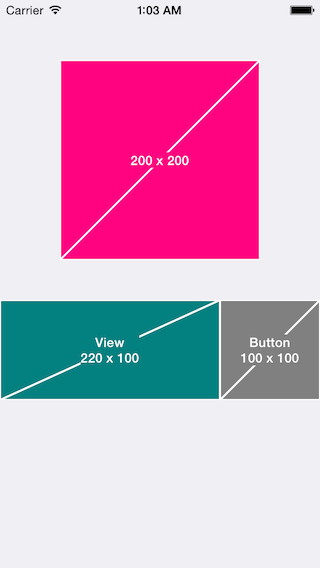

# Masu-Swift

[](https://travis-ci.org/midnightSuyama/Masu-Swift)
[](http://cocoadocs.org/docsets/Masu-Swift)
[](http://cocoadocs.org/docsets/Masu-Swift)
[](http://cocoadocs.org/docsets/Masu-Swift)

Placeholder for iOS prototyping with Swift



## Usage

To run the example project, clone the repo, and run `pod install` from the Example directory first.

``` swift
import Masu_Swift

// UIView demo
let masu = Masu(frame: CGRectMake(0, 300, 220, 100))
masu.backgroundColor = UIColor(red: 0, green: 0.5, blue: 0.5, alpha: 1)
masu.text            = "View"
self.view.addSubview(masu)

// UIImage demo
let btn = UIButton.buttonWithType(UIButtonType.Custom) as! UIButton
btn.frame = CGRectMake(220, 300, 100, 100)
btn.setImage(Masu.imageWithSize(btn.frame.size, backgroundColor: UIColor.grayColor(), labelText: "Button"), forState: UIControlState.Normal)
self.view.addSubview(btn)
```

### Category

``` swift
view.showMasu()
```

## Installation

Masu is available through [CocoaPods](http://cocoapods.org). To install
it, simply add the following line to your Podfile:

``` ruby
pod "Masu-Swift"
```

## Author

midnightSuyama, midnightSuyama@gmail.com

## License

Masu is available under the MIT license. See the LICENSE file for more info.
